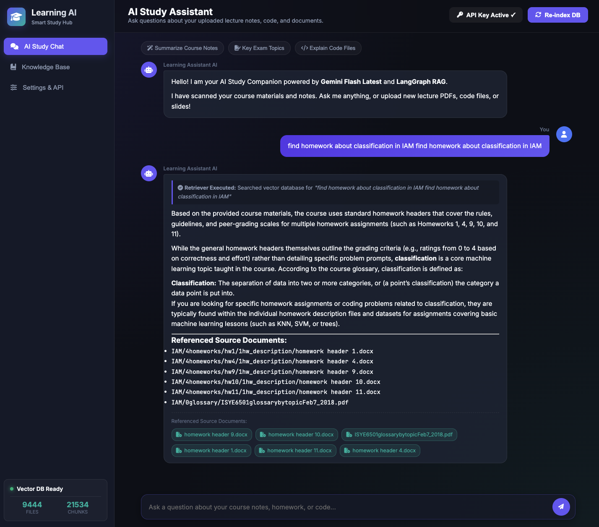
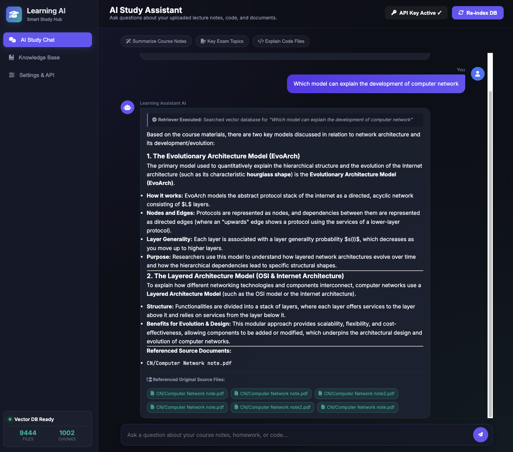
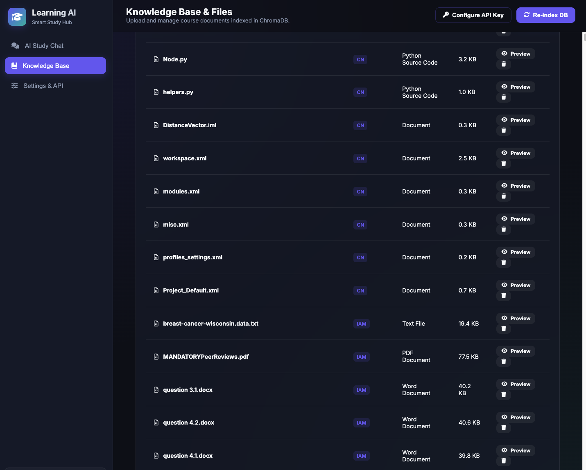

# 🎓 AI Learning Assistant Web Application

A full-stack, AI-powered study assistant and course material RAG system
built with **FastAPI**, **LangChain**, **LangGraph**, **ChromaDB**,
**Google Gemini**, and a sleek modern web interface.


------------------------------------------------------------------------

## 📸 Interface & Examples

### 1. Interactive Study Chat & Citations (Sample)

*Interactive sample demonstrating AI study assistance with source
document citations:* 

### 2. Interactive Study Assistance & Explanation (Sample)

*Interactive sample demonstrating detailed course topic explanations and
retrieved material:* 

### 3. Uploaded Course Documents & Workspace Management

*Workspace management view displaying uploaded course document folders
and vector database status:* 

------------------------------------------------------------------------

## ✨ Features

-   💬 **Interactive AI Study Chatbot**: Powered by LangGraph RAG
    workflow with multi-turn chat history, markdown code highlighting,
    and LaTeX math formula support.
-   📚 **Course Document Integration**: Upload and organize course documents with subfolders per course for document ingestion and automatic course metadata tagging.
-   🎯 **Smart Course-Aware Retrieval**: Automatically detects course
    context (e.g., Computer Networks `CN`, Analytics Modeling `IAM`) from subdirectories to return precise document matches.
-   🔑 **Dynamic Google Gemini API Key Setup**: Configure your Gemini
    API key directly in the UI modal or via `.env` file without code
    modifications.
-   📁 **Multi-Format Document Ingestion**: Supports `.pdf`, `.txt`,
    `.md`, `.docx`, `.py`, `.R`, and `.Rmd` files with batch drag-and-drop folder uploading.
-   🔍 **Original Source File Citations**: Cites exact original file
    paths (e.g. `CN/Computer Network note.pdf`) with interactive preview
    pills.
-   📊 **Vector Database Management**: Real-time stats on files, vector
    chunks, and one-click database re-indexing with ChromaDB.
-   🎨 **Glassmorphism UI Design**: Dark mode theme with glowing
    accents, responsive sidebars, micro-animations, and drag-and-drop
    upload zone.

------------------------------------------------------------------------

## 🚀 Quick Start

### Launch the Application

Run the app launcher script:

``` bash
./learning_assistant
```

Or execute directly with Python:

``` bash
python3 run_app.py
```

The application starts on `http://localhost:8000` and opens
automatically in your default web browser. Once launched, you can upload and manage course document folders directly through the web interface.

------------------------------------------------------------------------

## 🏗️ Project Architecture

```         
LearningAssistant/
├── backend/
│   ├── app.py                  # FastAPI server (Endpoints for Chat, Uploads, API Key, Stats)
│   ├── rag_engine.py           # LangGraph RAG engine & ChromaDB Vector Store integration
│   └── scanner.py              # Multi-format document parser & workspace scanner
├── frontend/
│   ├── index.html              # Single Page Application HTML interface
│   ├── css/
│   │   └── styles.css          # Dark glassmorphism styling & design system
│   └── js/
│       └── app.js              # SPA client state manager & reactive UI logic
├── courses_db/                 # ChromaDB persistent vector database storage
├── examples/                   # Application screenshot assets (1.png, 2.png, 3.png, 4.png)
├── learning_assistant.ipynb    # 📝 Initial Draft Notebook (original prototype & RAG experiment pipeline)
├── run_app.py                  # Application server entry point
└── README.md                   # Project documentation
```

------------------------------------------------------------------------

## 📝 Initial Draft Notebook (`learning_assistant.ipynb`)

The file [`learning_assistant.ipynb`](file:///Volumes/macmini%20extra%20hd/projects/LearningAssistant/learning_assistant.ipynb) is designated as the **Initial Draft** and original RAG prototype for this project:
- **Foundational Prototype**: Contains the initial exploratory code testing LangChain document loaders, ChromaDB vector storage, and LangGraph workflow setup.
- **GT Course Material Testing**: Georgia Tech (GT) course materials were used to test and validate early document ingestion and parsing logic during prototype development.
- **Project Evolution**: The workflow established in this initial draft notebook was refactored and scaled into the production FastAPI application (`backend/` & `frontend/`).

------------------------------------------------------------------------

## ⚙️ Configuration & Environment

-   **API Key Configuration**: Enter your key in the web UI (header 🔑
    button or Settings) or save it in `.env` as
    `GOOGLE_API_KEY=your_key`.
-   **Course Document Storage**: Uploaded course document subfolders (e.g., `CN/`, `IAM/`) are automatically scanned, parsed, and indexed with course tag metadata.
-   **Vector Storage**: Persistent embeddings are stored locally in
    `courses_db/`.

------------------------------------------------------------------------

## 🌐 API Reference

| Endpoint                 | Method   | Description                                                |
|------------------------|------------------------|------------------------|
| `/api/stats`             | `GET`    | Retrieve database metrics, file counts, and API key status |
| `/api/config/api-key`    | `POST`   | Update Gemini API Key dynamically                          |
| `/api/config/api-key`    | `DELETE` | Clear Gemini API Key                                       |
| `/api/documents`         | `GET`    | List all workspace course documents                        |
| `/api/documents/upload`  | `POST`   | Batch upload and index course files                        |
| `/api/documents/preview` | `GET`    | Fetch document preview text                                |
| `/api/documents/delete`  | `POST`   | Remove document from workspace & vector database           |
| `/api/documents/reindex` | `POST`   | Rebuild vector DB collection from workspace documents      |
| `/api/chat`              | `POST`   | Multi-turn RAG Chat execution                              |
